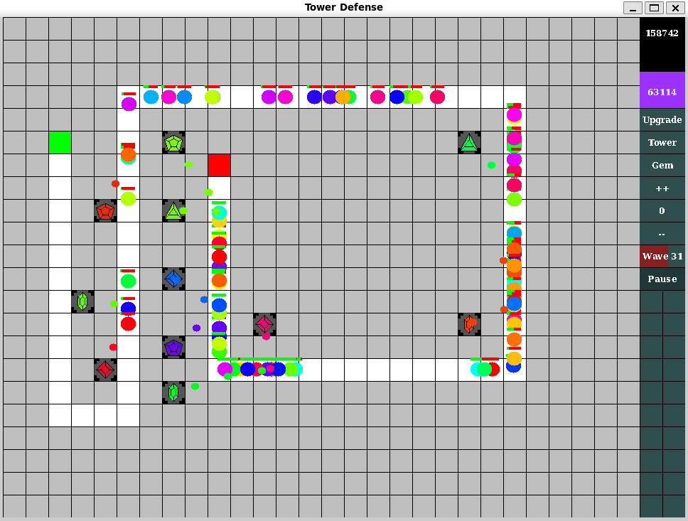
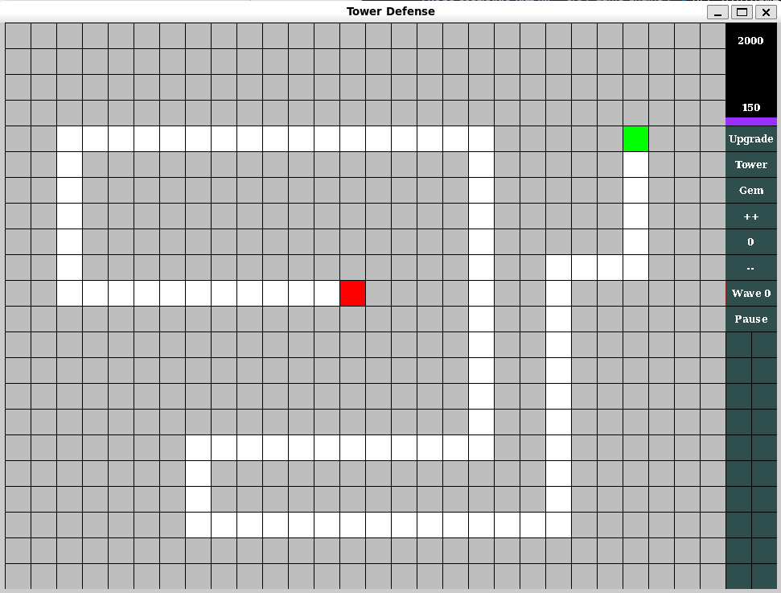
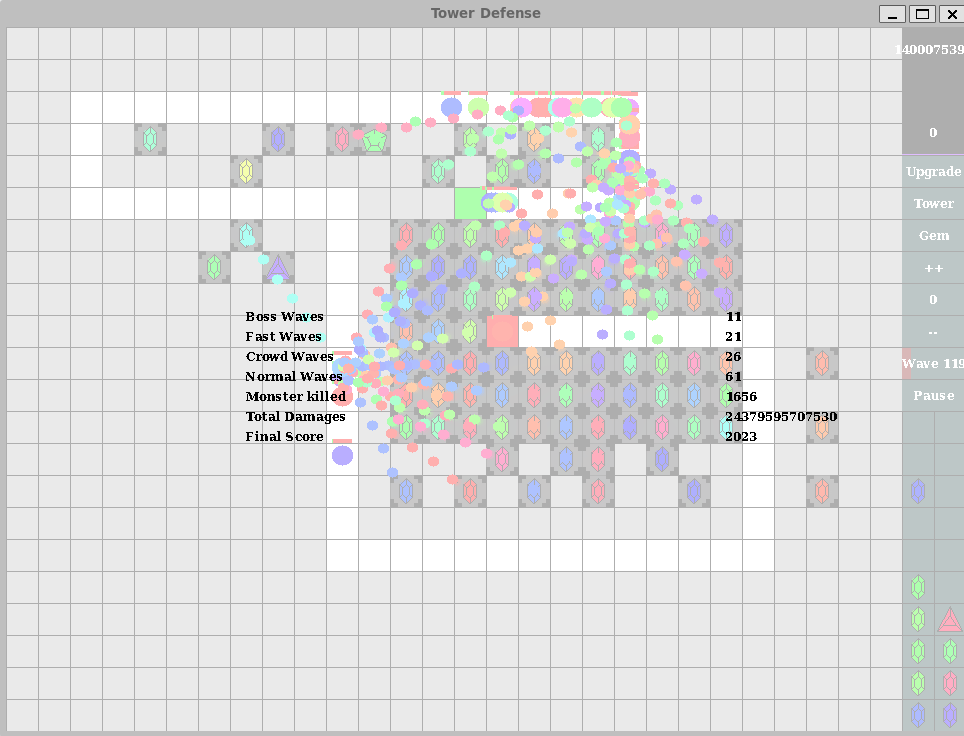

# GemCraft
[Alain Coserariu](https://github.com/AlainCoserariu) & [Rémy Kies](https://github.com/GouruRK)
___

Tower defense game inspired by the [GemCraft games](https://en.wikipedia.org/wiki/GemCraft) made with [Alain Coserariu](https://github.com/AlainCoserariu).


*Game screenshot*

# Table of Contents

- [GemCraft](#gemcraft)
- [Table of Contents](#table-of-contents)
  - [Installation](#installation)
  - [Run](#run)
  - [Game principle](#game-principle)
    - [Gems](#gems)
    - [Controls](#controls)
  - [Features](#features)

## Installation

To download our project, you can either
* dowload the .zip file and un-zip it to create a directory called *"GemCraft"*
* use git command `git clone https://github.com/GouruRK/GemCraft.git` to create the *"GemCraft"* directory

This project uses `LibMLV` as the graphical interface. Please, check [this guide](https://www-igm.univ-mlv.fr/~boussica/mlv/api/French/html/installation.html) to install it, or use the following commands :

```shell
sudo apt update
sudo add-apt-repository universe
sudo apt install libmlv3-dev
```

## Run

Once in the *"GemCraft"* directory, use the `make` command to compile the project. It creates an executable `GemCraft` which you can simply run by typing `./GemCraft`, or by using the `run` target of the makefile

```shell
./GemCraft
```
or
```shell
make run
```

No command line options are required.

A technical documentation can be created using [doxygen](https://www.doxygen.nl/) and the following command: 

```shell
doxygen doxyfile
```

## Game principle


*Example of a starting position*

Your goal is to survive as long as you can, by preventing the monster's waves that spawn from the `nest` (the red tile) from going to your camp (the green tile).

To gain time, you have to use your mana wisely to create towers and place gems to shoot monsters. Placing towers, upgrading your mana pool, creating gems and combining them cost you mana, while killing monsters and starting a wave before the timer runs out of time give you mana.

### Gems

There are three types of gems, each one with different effects:
* **Pyro** (the red ones): when a projectile comes from a **pyro** gem and hits a monster, the nearby monsters take damage too
* **Dendro** (the green ones): poison effect: targeted monster takes small damages for 10 seconds
* **Hydro** (the blue ones): slow the targeted monster

When a monster is hit by mutiple projectiles from different gem types, other effects are applied.

When combining two gems of different type, they lose their effect. You can use the `right click` to show information about a gem, its level and its type.

### Controls

The game can entirely be played with the mouse, using the `left click` to pick and place objects and use the different buttons, and the `right click` to display information about a gem or to drop the selected object.

However, some keyboard shortcuts exits to make it easier to play:
* `u` upgrade the mana pool
* `t` summon a tower
* `g` create a gem of the current displayed level 
* `+` increase the gem level by one
* `-` decrease the gem level by one. If the level is zero, then go to the higher level possible
* `w` summon the next wave
* `p` pause the game

*Note that the plus and minus on the numeric keypad may not work depending of your system*

## Features

* A new path is randomly generated each time the game is launched
* Gems have different shapes depending on their level
* Each 6 waves, the player can choose between multiple upgrades
* And many more ! 


*Final score*

___
[Alain Coserariu](https://github.com/AlainCoserariu) & [Rémy Kies](https://github.com/GouruRK)
